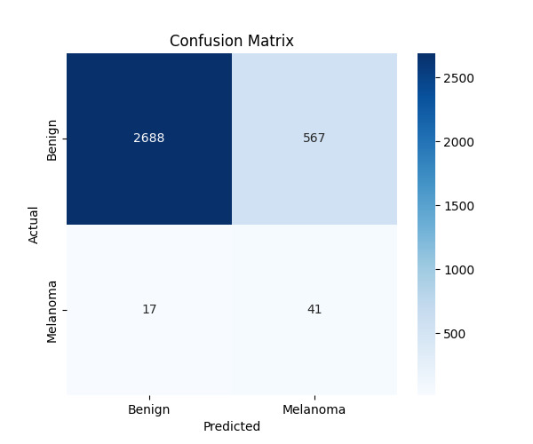

# Melanoma Detection using EfficientNet & PyTorch DDP

## 🏥 Overview
This project aims to detect melanoma skin cancer using deep learning. We trained an EfficientNet model using PyTorch Distributed Data Parallel (DDP) for efficient multi-GPU/multi-node training. The system integrates a Flask backend and a React frontend for image upload and real-time classification.

---

## 📌 Features
- **EfficientNet-based CNN model** trained on the SIIM-ISIC dataset
- **Distributed Training with PyTorch DDP** (trained for 15-16 hours)
- **Flask backend** for model inference
- **React frontend** for user-friendly image uploads
- **Automated Authentication System** using Firebase
- **Confusion Matrix & Performance Metrics**

---

## 🚀 Tech Stack
### 🔹 Machine Learning & Training
- **PyTorch** (Distributed Data Parallel)
- **EfficientNet (via TIMM Library)**
- **Albumentations** (Data Augmentation)
- **Scikit-learn** (Confusion Matrix & Metrics)

### 🔹 Backend
- **Flask** (Python Web Framework)
- **PyTorch** (Model Inference)

### 🔹 Frontend
- **React + Mantine UI** (for UI/UX Design)
- **React Router** (for Navigation)
- **Firebase Authentication**

---

## 📂 Project Structure
```
SkinDiseaseDetection/
├── frontend/               # React Frontend (Vite Project)
│   ├── src/
│   │   ├── pgs/           # Pages (Login, Signup, Home, etc.)
│   │   ├── assets/        # Static assets
│   │   ├── App.jsx        # Main Component
│   │   ├── index.css      # Styles
├── backend/               # Flask Backend
│   ├── run.py
│   ├── requirements.txt   # Dependencies
│   ├── app/               
│   ├── config.py          
├── ml-model/              # ML Model
│   ├── script.py          # PyTorch DDP Training Script
│   ├── efficientnet_melanoma_best.pth # Trained Model
│   ├── confusion_matrix.png # Model Performance Visualization
└── README.md
```

---

## 🎯 Dataset & Preprocessing
- **Dataset:** SIIM-ISIC Melanoma Classification dataset
- **Preprocessing:**
  - Resized images to `224x224`
  - Applied data augmentations: Horizontal/Vertical Flip, Brightness Contrast
  - Normalized images (mean & std of ImageNet dataset)
  
---

## 🖼️ Confusion Matrix
The model's classification performance is visualized using a confusion matrix:



---

## 🛠️ Setup & Installation
### 1️⃣ Clone the Repository
```sh
git clone https://github.com/your-repo-url.git
cd SkinDiseaseDetection
```

### 2️⃣ Setup Backend (Flask API)
```sh
cd backend
pip install -r requirements.txt
python run.py
```

### 3️⃣ Setup Frontend (React)
```sh
cd frontend/vite-project
npm install
npm run dev
```

### 4️⃣ Run Model Training (DDP-based Training)
```sh
cd ml-model
python script.py
```

---

## 🌐 Frontend Demo 🎥
[](https://drive.google.com/file/d/1P7--2wLVu-X2PzPiawna9gjFJeiKFBGC/view?usp=sharing)

---

## 📊 Results & Performance
- **Best Validation Accuracy:** `82.37%` (mention achieved accuracy)
- **Loss Reduction Trend:** Model showed smooth convergence with AdamW optimizer.
- **Balanced Predictions:** Despite an imbalanced dataset, weighted cross-entropy loss helped improve recall.

---

## 🔥 Future Enhancements
- Implement **Grad-CAM** for explainability.
- Improve dataset balancing with **Synthetic Oversampling**.
- Optimize backend API with **FastAPI** for better performance.
